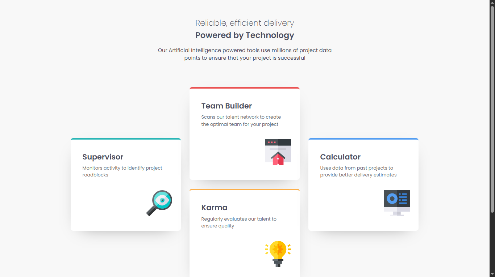

# 🧩 Four Card Feature Section

  

A responsive feature section built with HTML and CSS as part of a Frontend Mentor challenge.

## 📖 About the Challenge

This project is a solution to a Frontend Mentor challenge focused on building a responsive feature section using CSS Grid while recreating a more advanced desktop layout.

## ✨ Highlights

- 📱 Responsive layout for mobile, tablet, and desktop.
- 🧩 Desktop layout built with CSS Grid.
- 🎨 Clean typography using Google Fonts.
- 🏗️ Semantic HTML structure.
- 📐 Mobile-first workflow.
- 💡 Well-organized and maintainable CSS.

## 🛠️ Built With

  

## 💡 Key Takeaways

Throughout this project, I:

- Strengthened my understanding of CSS Grid by creating a complex desktop layout.
- Learned how to position grid items precisely using custom rows and columns.
- Improved my ability to translate a visual design into a structured grid layout.
- Practiced building responsive layouts while keeping the HTML simple and semantic.
- Gained more confidence in choosing CSS Grid for layouts that would be difficult to build with Flexbox alone.

## 🔗 Links

- 🌐 **Live Site:** https://frontend-mentor-four-card-feature-s-two.vercel.app/
- 💻 **Repository:** https://github.com/Ziad-mo205/Frontend-Mentor---Four-card-feature-section.git
- 🎯 **Frontend Mentor Solution:** https://www.frontendmentor.io/solutions/responsive-page-using-ltnQZ_Qu2r